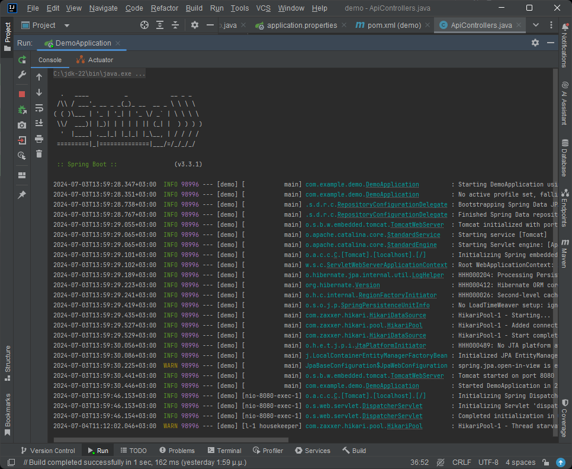
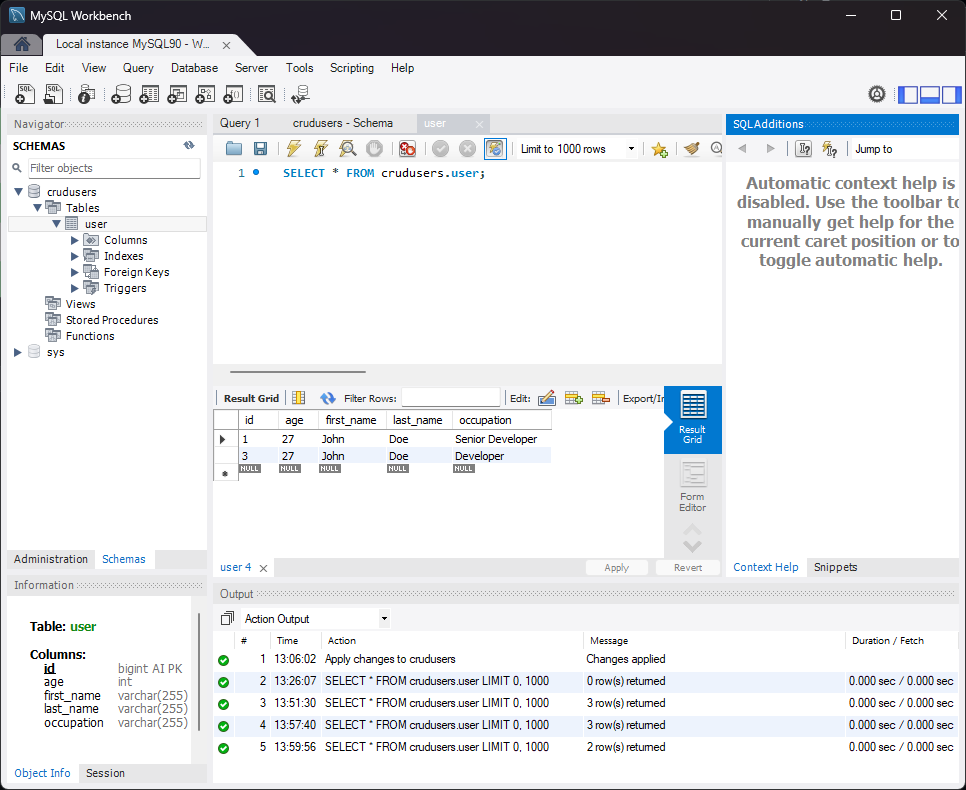
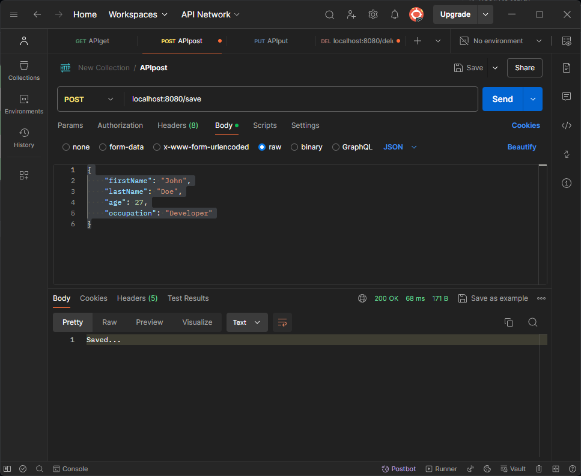
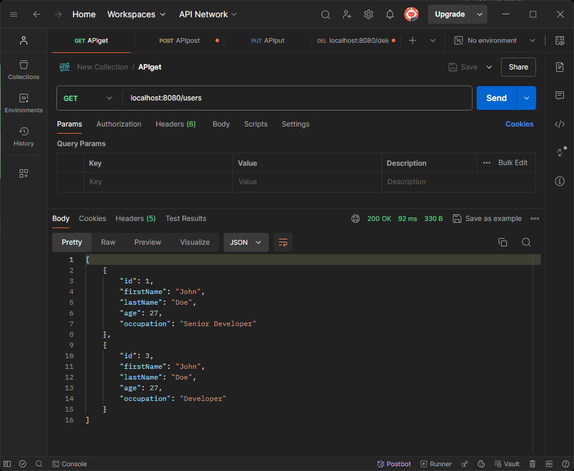

# RESTful CRUD API with Spring Boot, Maven, JPA, and MySQL

This project is a simple example of a RESTful CRUD API built using Spring Boot, Maven, JPA, and MySQL. The API is designed to perform basic CRUD (Create, Read, Update, Delete) operations on a sample resource.

## Project Setup

1. **Clone the repository**

2. **Import Project into IDE**:
   - Open IntelliJ IDEA (or your preferred IDE).
   - Import the project using the `pom.xml` file.

3. **Run the Application**:
   - Run the main application class `RestApiApplication`.
   - The application will start on port `8080`.

## API Endpoints

### Sample Endpoint

- **GET /**
  - Returns a welcome message.

### User Endpoints

- **GET /users**
  - Retrieves all users.

- **POST /save**
  - Creates a new user.
  - Example request body:
    ```json
    {
      "firstName": "John",
      "lastName": "Doe",
      "age": 30,
      "occupation": "Developer"
    }
    ```

- **PUT /update/{id}**
  - Updates an existing user by ID.
  - Example request body:
    ```json
    {
      "firstName": "Jane",
      "lastName": "Doe",
      "age": 25,
      "occupation": "Designer"
    }
    ```

- **DELETE /delete/{id}**
  - Deletes a user by ID.

## Testing the API with Postman

1. Open Postman.
2. Create a new request.
3. Use the appropriate HTTP method and URL for the endpoint you want to test.
4. For POST and PUT requests, set the body to `raw` and choose `JSON` format.
5. Send the request and observe the response.

## Screenshots








